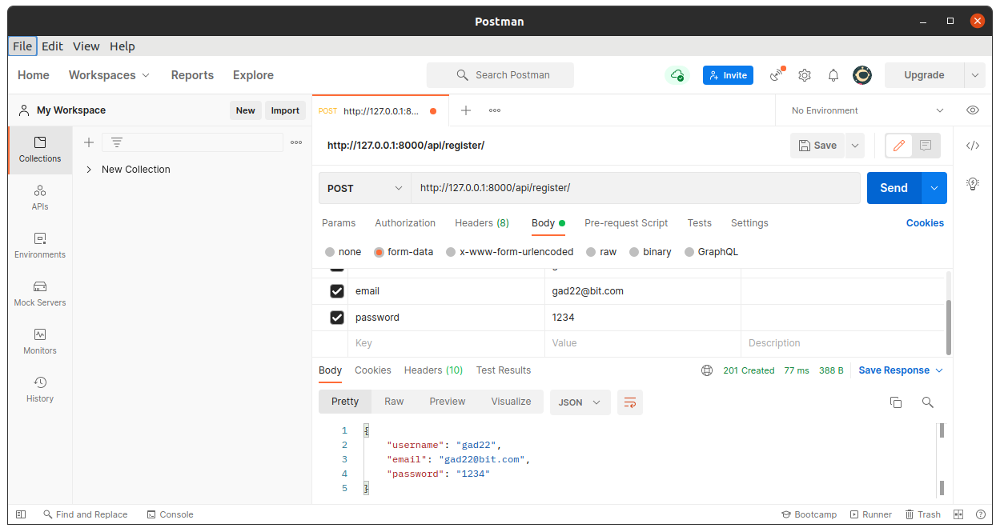

Django app to register,login and logout user  ,geting products from database and make some operation like filter and order using REST API framework.

# Django REST Framework - UserRegistration-Authentication

## How to use:
  - `pip install -r requirements.txt`
  - `python manage.py runserver`
  
## URLs to target:
  - to register a user
    - localhost:8000/api/register/
	
  

  - to login a user
    - localhost:8000/api/login/
	
  

  - to logout a user
    - localhost:8000/api/logout/
	
  - to get product
    - localhost:8000/api/product/
	
  

	
  - to filter by user
    - localhost:8000/api/product/?search
	
  

	
  - to order by price ascending
    - localhost:8000/api/product/?ordering=price
	
  

	
  - to order by price dscending
    - localhost:8000/api/product/?ordering=-price
	
  

## Useful commands:
  - 'python manage.py createsuperuser'
  - 'python manage.py makemigrations'
  - 'python manage.py migrate'

  - 'pip install pylint-django'
